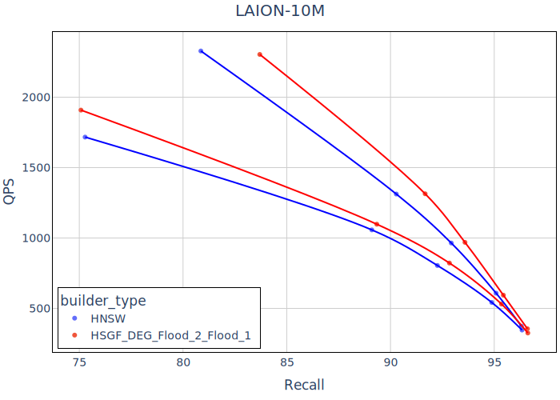

# Hierarchical Search Graph Framework (HSGF)

The Hierarchical Search Graph Framework (HSGF) is the main contribution of a master's thesis at the Data Mining Group at TU Dortmund (2025). HSGF allows for extending existing approximate nearest neighbor search (ANNS) graphs with a hierarchy architecture and corresponding redundancy to improve their search performance in terms of recall and queries-per-second (QPS).

This project is built on the framework that is the [GraphIndexAPI](https://github.com/eth42/GraphIndexAPI) crate, follows closely the patterns of the [GraphIndexBaselines](https://github.com/eth42/GraphIndexBaselines) crate, and can, therefore, be seen as an extension to the latter.

## Research Findings - Quick overview 

We find positive effects from the hierarchy architecture for a HSGF graph which uses a DEG graph on all its levels which can seen in Figure 1 by the red curve for the higher level which is more to the top right in the plot then the search performance curve for its bottom level, which corresponds to "just" the DEG graph itself. The bottom curve for the HNSW graph is irrelevant in this view, as the upper blue curve corresponds to the search performance "normally" measured for an HNSW graph. Given the shorter construction time of the DEG graph compared to the HNSW graph on the full dataset and the substantially smaller subset sizes for the graphs on the higher levels (which induce the hierarchy architecture and redundancy itself; see Table 1), the HSGF shows that the search performance of a base graph can be boosted by extending it with a hierarchy design.

The hierarchy effect on the search performance shows (expectedly) less strong for $ef_{bottom} >> k$ and has smaller to no effects for very sparse graphs, e.g., RNN-Descent or NSSG as well as datasets with a high local intrinsic dimensionality, e.g., GLOVE-100.



Figure 1: QPS over Recall for the HSGF-DEG-Flooding=2-Flooding=1 vs. HNSW graphs on the LAION-10M dataset for $k$=1, $e\!f_{higher}$=1 and different $e\!f_{bottom}$=[10, 20, 30, 50, 100]. For each graph, the lower curve
shows the search started only from the bottom level, and the upper curve shows the search
started from the top level. 


| Level | HSGF-DEG-Flooding=2-Flooding=1 | HSGF-DEG-Random | HNSW |
|-|-|-|-|
| Graph 0      | 2624.48 s                   | 2665.97 s | /       |
| Subset 1     | 70.62 ms                    | 1.01 ms   | /       |
| Graph 1      | 3.74 s                      | 4.08 s    | /       |
| Subset 2     | 1.40 ms                     | 59.77 µs  | /       |
| Graph 2      | 93.86 ms                    | 92.52 ms  | /       |
| Subset 3     | 239.58 µs                   | 7.94 µs   | /       |
| Graph 3      | 5.14 ms                     | 5.25 ms   | /       |
| Subset 4     | 90.41 µs                    | 2.26 µs   | /       |
| Graph 4      | /                           | 218.53 µs | /       |
| Overall Time | 2724 s                      | 2777 s    | 10834 s |
| Subset Sizes | [10120191, 33811, 2540, 191] | [10120191, 35000, 2500, 200, 30] | [10120191, 337332, 11256, 353, 16] |

Table 1: HSGF-DEG build information on the LAION-10M dataset (which consists of 10,120,191 vectors). Both graphs have been built with the same level graph parameters of the DEG with an out-degree=50 and $e\!f_{construction}{=}100$. Note the different time scales and that the level starts at index zero; consequently, the first subset is for level one.


## Contents

- `/src` 
    - hsgf code
    - See more information further down in this README
- `/GraphIndexAPI`
    - Uses a fork of the external library from [GitHub](https://github.com/eth42/GraphIndexAPI)
        - Current diff is virtually zero
    - Some useful explainers
        - WUnDirLoLGraph: Weighted Un-Directed List-of-List Graph
- `/GraphIndexBaselines`
    - Uses a fork of the external library from [GitHub](https://github.com/eth42/GraphIndexBaselines)
        - Current diff is virtually zero
- `/evaluation`
    - Evaluation related files (see local README)

## Installation

- Pyo3 with [maturin](https://www.maturin.rs/) to build the _hsgf_ Python module/binding
```bash
python3 -m venv .env
source .env/bin/activate
pip install -r py_requirements.txt
maturin develop
# In one line:
# python3 -m venv .env; source .env/bin/activate; pip install -r py_requirements.txt; maturin develop
```

## HSGF - Crate

- About hierarchy (ANNS) graphs..
    - A hierarchy graphs consist of multiple (>1) graphs which are stacked vertically on each other and each level-graph contains a subset of the previous layer. With the bottom layer/level/graph containing all points of the training data
    - The HSGF builds hierarchy graphs which are similar to [HNSW](https://ieeexplore.ieee.org/document/8594636) but HSGF uses existing graphs and constructs hierarchy graphs from the bottom-level sequentially up
    - The HSGF adds relatively minimal overhead due to the significantly smaller (level-)subset-sizes on levels above the bottom level (0.5-5% of the training data is only contained on the second level already)

- General
    - Each graph builder
        - Has a single and parallel version
        - Where the single one is closer to the original reimplemented code base, while the parallel one has fewer or none of the original code comments and is generally more optimized 
    - Building hierarchy graphs from the bottom up
        - Allows to specify (available) graph builders and subset selectors for each level
    - One trait definition for the HSGFStyleBuilder, which can be either an Enum- or a ClosureStyleBuilder
    
- DEG
    - Reimplementation from here [GitHub](https://github.com/Visual-Computing/DynamicExplorationGraph/)
    - Based on the main branch, specifically commit `305e121`
        - Specifically relevant for the re-implementation is [builder.h](https://github.com/Visual-Computing/DynamicExplorationGraph/blob/main/cpp/deglib/include/builder.h)
        - Important, this corresponds to the latest version of the DEG by the authors, and not the later renamed (and original) crEG implementation. However, we expect the latest version to also be the most performant.
- (N)SSG
    - Reimplementation from here [GitHub](https://github.com/ZJULearning/SSG/)
    - Based on the master branch, specifically commit `f573041`
        - Specifically relevant for the re-implementation is [index_ssg.cpp](https://github.com/ZJULearning/SSG/blob/master/src/index_ssg.cpp)
- Efanna 
    - Reimplementation from here [GitHub](https://github.com/ZJULearning/efanna_graph)
    - Based on the master branch, specifically commit `50c4445`
        - Specifically relevant for the re-implementation is [index_graph.cpp](https://github.com/ZJULearning/efanna_graph/blob/master/src/index_graph.cpp)
- RNGG
    - Builds a random graph that allows for fast and basic testing and evaluation
- Selectors 
    - Random, Flooding, FloodingRepeat, Hubs
    - See file for more information on the different selectors and their relevance
- `src/utils`
    - Utility, primarily for evaluation
- `src/py`
    - Collective folder and exports to generate the Python binding *hsgf*
    - /benches/bench.py can be seen as a unit tester for the Python binding *hsgf*


## Dev Notes
- `cargo test` can not be successfully run if the default features include pyo3 (not the case here)
    - If so, use `cargo test --no-default-features` instead 
        - For reference see [pyo3 FAQ](https://pyo3.rs/v0.23.4/faq.html#i-cant-run-cargo-test-my-crate-cannot-be-found-for-tests-in-tests-directory)

- The formatting via `cargo fmt` needs to be triggered manually sometimes in /src/py/* because of the pyo3 annotations

- VS Code
    - The following makes the rust-analyzer in VS Code analyze files that are behind a particular feature flag
        - Settings: "rust-analyzer.cargo.features": ["<FEATURE>"]
    - Nice highlighting for TOML files
        - "[toml]": {"editor.defaultFormatter": "tamasfe.even-better-toml"}

- Useful aliases and functions
```bash
alias senv="source .env/bin/activate"
alias mdev="maturin develop"

alias carc="cargo check"
alias carbu="cargo build"
alias cart="cargo test"
alias carbe="cargo bench -- --nocapture"

function carunit {
    # cargo test --package CRATE_NAME --lib -- FILE_NAME::tests::UNIT_TEST_NAME --exact --show-output --nocapture
    # Example (when in /hsgf): carunit deg deg_construction
    cargo test --no-default-features --package hsgf --lib -- $1::tests::$2 --exact --show-output
}

function carflame {
    timestamp=$(($(date +%s%N)/1000000))
    filename="flamegraph_$1_${timestamp}.svg"
    # cargo flamegraph --root --unit-test -- UNIT_TEST_NAME --nocapture
    cargo flamegraph -o $filename --root --unit-test -- $1 --nocapture --no-default-features; open -a "Brave Browser" $filename
}
```

## Project Information
- Author: Colin Kolbe
- Year: 2025